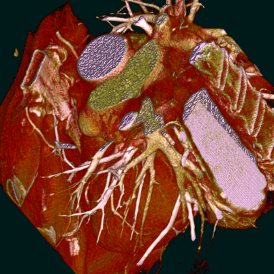
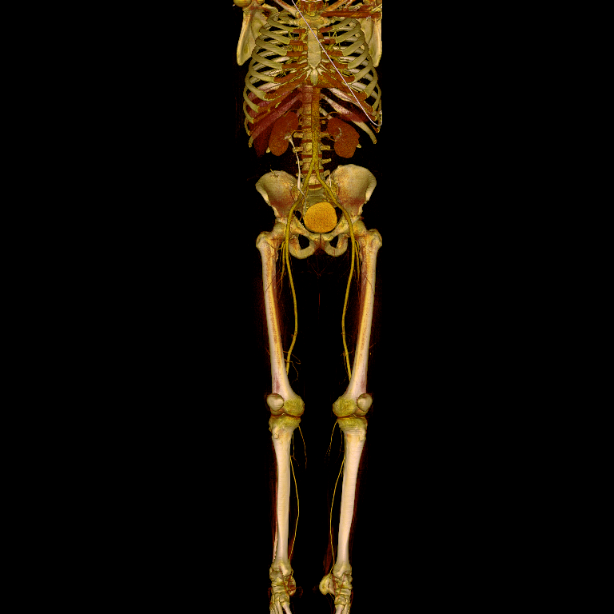
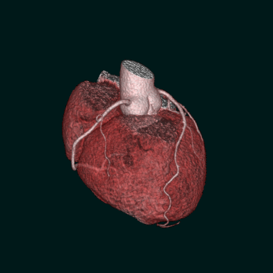
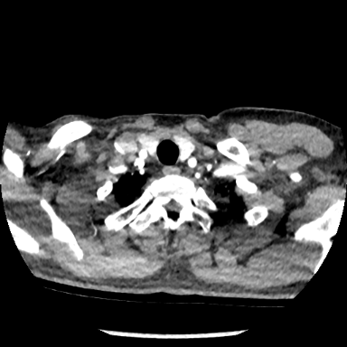
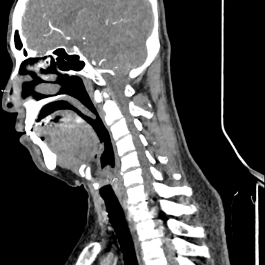
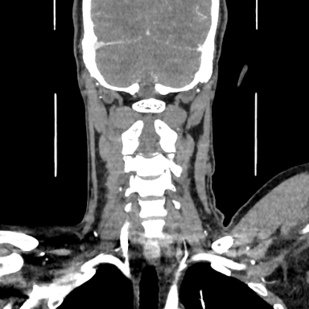
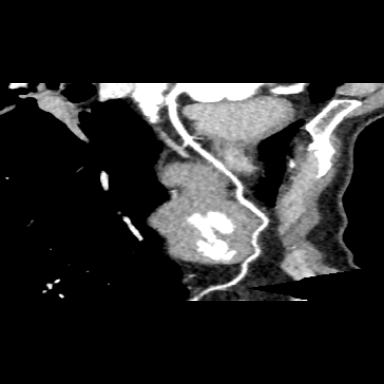
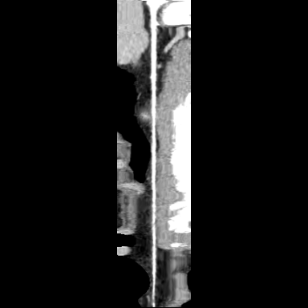

# MonkeyGL (Monkey Graphic Library)
>A fast 3d render library for the medical imaging.    
>All the calculations are based on the cuda (@Nvidia company).  
>Totally independent of the OpenGL context.

## requirements (so far)
> ubuntu 20.04 LTS  
> cuda 11.6.0  
> intel cpu  
> g++ (Ubuntu 9.4.0-1ubuntu1~20.04.1) 9.4.0  
> Python 3.9.5

## install cuda
### linux (tested in Ubuntu)
>./install/cuda_install_ubuntu.sh

## build project
### linux (tested in Ubuntu)
>command: bash ./build.sh {project name} {build_type}  
>project name: cpp / pybind  
>build type: Debug / Release / Clean  
>project cpp: will get c++ shared library (libMonkeyGL.so) in ./build, which can be called by cpp.  
>project pybind: will get pybind11 shared library (pyMonkeyGL.so) in ./pybind11_interface/build, which can be called in python.  

## examples
### cardiac.raw
>size: 512 x 512 x 361  
>spacing: 0.351 x 0.351 x 0.3  
>direction: [1, 0, 0; 0, 1, 0; 0, 0, -1]  
>render performance(no sampling): 25 fps  

### body.raw
>size: 512 x 512 x 1559  
>spacing: 0.7422 x 0.7422 x 1.0  
>direction: [1, 0, 0; 0, 1, 0; 0, 0, -1]  
>render performance(no sampling): 25 fps  

### multi volume rendering with the different alpha value
>

### MPR
>

### CPR
>
